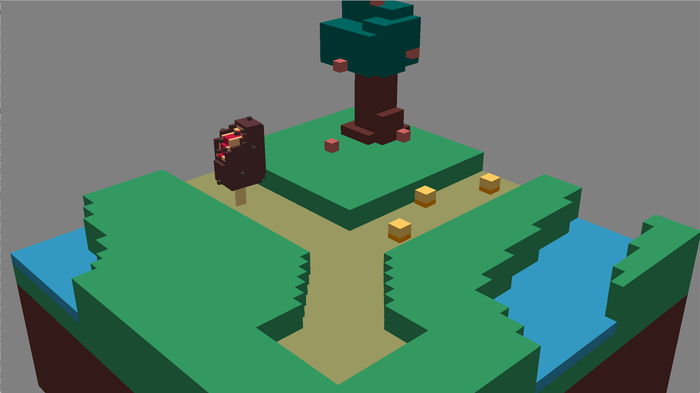

# Gretel

Author: Michelle Chang, Qingyi Dong

Design: 

A of the famous German fairy tale. You will be playing Gretel, and manage to guide her home.

Text Drawing: 
- render quads of texts using Freetype and Harfbuzz
- render font bitmaps stored in Freetype's face object as textures
- texts are rendered at runtime

Screen Shot:

How To Play:

- Try to indicate which of the sweets Gretel left on the road to guide her home from the plot.
- Use UP/DOWN arrow keys to switch among the choices.
- Use ENTER key to confirm selecting the choice or proceed to the next text scene.

Sources: 

- Voxel characters created with [MagicaVoxel](https://ephtracy.github.io/)

This game was built with [NEST](NEST.md).

